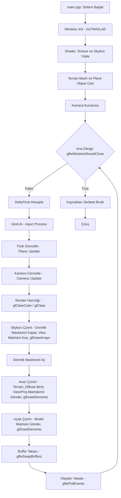

**Projenin Tamamlandığında Çalışma Şekli**

Sistem başlatıldığında kullanıcı, prosedürel olarak üretilmiş veya bir yükseklik haritasından (heightmap) okunmuş 3 boyutlu bir arazinin üzerinde yer alan bir uçağı (veya serbest kamerayı) kontrol eder. Uzay/gökyüzü boşluğu, sahneyi her yönden saran bir Küp Haritası (Skybox/Cubemap) ile kaplanmıştır, bu sayede sonsuz derinlik hissi sağlanır. 

Kullanıcı W, A, S, D tuşları ile uçağın itki gücünü ve yönelimini ayarlar; fare hareketleri uçağın burun aşağı/yukarı (Pitch), sağa/sola dönüş (Yaw) ve kendi ekseni etrafında yuvarlanma (Roll) eksenlerini kontrol eder. Zemin ve nesne yüzeylerine atanmış yüksek çözünürlüklü dokular (textures), kamera nesneden uzaklaştıkça performans kaybını ve görsel bozulmaları (aliasing) önlemek için eşyönlü filtreleme (anisotropic filtering) ve Trilinear Mipmapping (GL_LINEAR_MIPMAP_LINEAR) işlemleriyle dinamik olarak düşük çözünürlüklü versiyonlarına geçiş yapar.

**Teknoloji Yığını (Tech-Stack)**

* **Programlama Dili:** C++ (Standart: C++17)
* **Grafik API:** OpenGL (3.3+ Core Profile)
* **Pencere ve Girdi Yönetimi:** GLFW
* **OpenGL Yükleyicisi:** GLAD
* **Matematik:** GLM (Matris çarpımları, Vektörler, Kuaterniyonlar)
* **Doku Yükleyici:** SOIL (Simple OpenGL Image Library) veya alternatif olarak stb_image.h
* **Derleme Aracı:** CMake

---

**Sistem Tasarımı ve Mimari**

Simülasyon mimarisi, girdi işleme (input handling), fizik/hareket güncellemesi ve çizim (rendering) aşamalarının birbirinden kesin çizgilerle ayrıldığı bir oyun döngüsü (Game Loop) üzerine inşa edilir.

1.  **6-DOF (Altı Serbestlik Derecesi) Kamera/Obje Mimarisi:** Uçuş simülasyonlarında standart Euler açıları Gimbal Lock (eksen kilitlenmesi) sorununa yol açar. . Bu nedenle rotasyon işlemleri Kuaterniyonlar (Quaternions) kullanılarak hesaplanır. Uçağın yönelim matrisi, her karede (frame) ileri (forward), yukarı (up) ve sağ (right) vektörlerinin güncellenmesiyle oluşturulur.
2.  **Skybox ve Küp Haritalama Mimarisi:** Skybox, sahnedeki diğer tüm nesnelerden önce veya en son (derinlik testi optimizasyonu ile) çizilir. Kamera hareket ederken Skybox'ın konumu kameranın konumuna kilitlenir (View matrisindeki öteleme değerleri sıfırlanır), böylece kullanıcının gökyüzüne ulaşması engellenir.
3.  **Doku ve State (Durum) Yönetimi Mimarisi:** OpenGL bir state makinesidir. `TextureManager` sınıfı, yüklenen dokuların ID'lerini saklar. Çizim aşamasında CPU'dan GPU'ya gereksiz veri transferini önlemek için sadece doku değiştiğinde `glBindTexture` ve `glActiveTexture` çağrıları yapılır.

---

**Klasör Yapısı Ağacı (Directory Tree)**

```text
FlightSimGL/
├── CMakeLists.txt              # Bağımlılık (SOIL, GLM, vs.) ve derleme direktifleri.
├── res/                        # Statik kaynaklar
│   ├── shaders/
│   │   ├── model.vert / .frag  # Uçak ve arazi için temel aydınlatma ve doku shader'ı.
│   │   └── skybox.vert / .frag # Cubemap için özel shader (View matrisi kırpılmış).
│   ├── textures/
│   │   ├── terrain_diffuse.jpg # Zemin kaplaması.
│   │   ├── heightmap.png       # Arazi yükseklik verisi (Siyah-beyaz).
│   │   └── skybox/             # front, back, top, bottom, right, left yüzey görselleri.
│   └── models/
│       └── plane.obj           # Uçak 3D modeli.
├── vendor/                     # Dış kütüphaneler (GLAD, GLM, SOIL, OBJLoader).
└── src/
    ├── main.cpp                # Döngü başlangıcı, alt sistemlerin başlatılması.
    ├── Core/
    │   ├── Window.h/cpp        # GLFW bağlamı, klavye/fare callback fonksiyonları.
    │   └── Input.h/cpp         # Tuş durumlarını (basıldı/bırakıldı) tutan state yöneticisi.
    ├── Graphics/
    │   ├── Shader.h/cpp        # glCreateProgram, glCompileShader, Uniform atamaları.
    │   ├── Texture.h/cpp       # SOIL_load_OGL_texture çağrıları, Mipmap ayarları (GL_TEXTURE_MIN_FILTER).
    │   ├── Mesh.h/cpp          # VAO, VBO oluşturma ve glDrawArrays/Elements sarıcısı.
    │   ├── Skybox.h/cpp        # Küp geometrisi ve GL_TEXTURE_CUBE_MAP bind işlemleri.
    │   └── Camera.h/cpp        # Pitch, Yaw, Roll vektör matematiği, View/Projection matrisleri.
    └── Simulation/
        ├── Plane.h/cpp         # Uçağın hız, ivme ve rotasyon verilerini (Fizik) yöneten sınıf.
        └── Terrain.h/cpp       # Heightmap verisini okuyup grid (ızgara) köşe noktalarını üreten sınıf.
```

---

**Doğrusal Geliştirme İşleyişi (Adım Adım)**

1.  **Kurulum ve Pencere (Context) Başlatma:** CMake konfigüre edilir. `main.cpp` içinde GLFW başlatılır, `Window` sınıfı ile OpenGL 3.3 Core profili oluşturulur. GLAD ile fonksiyon göstericileri (pointers) yüklenir.
2.  **Kamera ve Vektör Matematiği:** `Camera` sınıfı inşa edilir. LookAt fonksiyonu kullanılarak View matrisi ve Perspective fonksiyonu ile Projection matrisi oluşturulur. W/A/S/D ile uzayda hareket eden basit bir serbest kamera (Flycam) yazılır. .
3.  **Doku (Texture) ve Mipmap Entegrasyonu:** `Texture` sınıfı yazılır. SOIL kütüphanesi kullanılarak `.jpg/.png` dosyaları RAM'e, oradan VRAM'e aktarılır. Shader üzerinde `sampler2D` kullanılarak ekrana test amaçlı düz bir dörtgen (quad) çizilir. Doku filtreleme (GL_LINEAR_MIPMAP_LINEAR) parametreleri bu aşamada ayarlanır.
4.  **Skybox (Cubemap) Uygulaması:** 6 yüzeyli doku `SOIL_load_OGL_cubemap` ile yüklenir. `Skybox` sınıfı oluşturulur. `skybox.vert` shader'ı içinde View matrisinin 4. sütunu ve 4. satırı silinerek (mat4 -> mat3 -> mat4 dönüşümü) öteleme (translation) iptal edilir. .
5.  **Arazi (Terrain) Üretimi:** `Terrain` sınıfı yazılır. Bir for döngüsü ile X-Z düzleminde bir ızgara (grid) oluşturulur. Y (yükseklik) değeri `heightmap.png` dosyasındaki piksel renk değerlerine (0.0 - 1.0 arası) göre belirlenir. Köşe koordinatları VBO'ya yüklenir.
6.  **Fizik ve Uçuş Mekanikleri:** `Plane` sınıfı oluşturulur. WASD ve Fare girdileri `Input` sınıfından çekilir. Uçağın hızı (velocity) ve rotasyon açıları güncellenir. Uçağın pozisyonu ve rotasyonu bir Model Matrisine (`glm::mat4`) dönüştürülüp shader'a gönderilir. Kamera uçağın arkasına (Third-Person) veya içine (First-Person) sabitlenir.
7.  **Optimizasyon ve Temizlik:** Geri yüzey kırpma (Backface Culling: `glEnable(GL_CULL_FACE)`) ve Derinlik Testi (`glEnable(GL_DEPTH_TEST)`) aktif edilir. Bellek sızıntılarını önlemek için sınıfların yıkıcı (destructor) metodlarında VAO/VBO ve Texture ID'leri silinir.

---

**Kod Akış Diyagramı**

