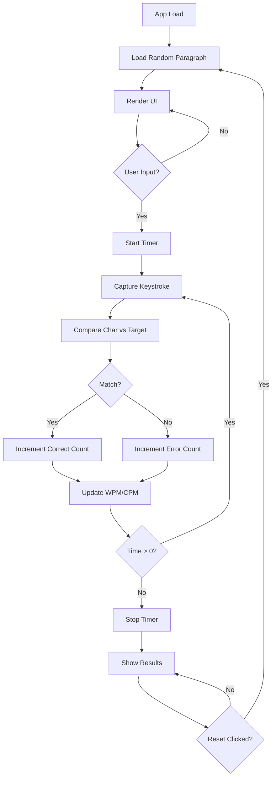

# PROJECT WORKING PRINCIPLE

When the application starts, a random paragraph is selected from the local text pool and rendered to the interface. As soon as the user focuses on the input area and types the first character, a 60-second countdown starts. Every keystroke is compared against the target text character by character, and each typed character is marked as correct or incorrect.

State management updates errors, elapsed time, total typed characters, and word count with sub-second precision. WPM and CPM values are calculated in real time and reflected in the UI immediately. When the timer reaches zero, the input area is locked, the result state is activated, and a performance summary is shown.

The reset button brings all state values back to their initial values, selects a new text, and resets the timer. The system is fully client-side, has no external API dependency, and minimizes direct DOM manipulation for performance.

## TECH STACK

- **Core:** React 19+
- **Build:** Vite
- **Language:** JavaScript (ES6+)
- **Styling:** CSS Modules
- **State:** React Hooks (useState, useEffect, useMemo, useCallback)
- **Testing:** Vitest + React Testing Library

## FOLDER STRUCTURE AND FILE RESPONSIBILITIES

```text
typing-speed-tester/
├── public/
│   └── favicon.ico
├── src/
│   ├── assets/
│   ├── components/
│   │   ├── Header/
│   │   │   ├── Header.jsx
│   │   │   └── Header.module.css
│   │   ├── TypingArea/
│   │   │   ├── TypingArea.jsx
│   │   │   ├── TypingArea.module.css
│   │   │   └── TypingArea.test.jsx
│   │   ├── Stats/
│   │   │   ├── Stats.jsx
│   │   │   └── Stats.module.css
│   │   ├── Timer/
│   │   │   ├── Timer.jsx
│   │   │   └── Timer.module.css
│   │   └── ResetButton/
│   │       ├── ResetButton.jsx
│   │       └── ResetButton.module.css
│   ├── hooks/
│   │   └── useTypingLogic.js
│   ├── utils/
│   │   ├── paragraphs.js
│   │   └── calculators.js
│   ├── App.jsx
│   ├── App.css
│   ├── main.jsx
│   └── index.css
├── .gitignore
├── package.json
└── vite.config.js
```

**File responsibilities:**

- `paragraphs.js`: Stores 50+ practice texts and exports `getRandomParagraph()`.
- `useTypingLogic.js`: Manages timer state, typing state, and computed metrics.
- `calculators.js`: Hosts helpers such as WPM, CPM, and accuracy calculations.
- `TypingArea.jsx`: Renders target text character by character and applies visual correctness states.
- `App.jsx`: Composes all feature components and wires state/actions.

## SYSTEM DESIGN AND ARCHITECTURE

**Architecture approach:** Component-based architecture. Main state is centralized in a custom hook and passed down through props.

**Example state shape:**

```javascript
const initialState = {
  text: '',
  userInput: '',
  timeLeft: 60,
  isTyping: false,
  isFinished: false,
  stats: {
    wpm: 0,
    cpm: 0,
    errors: 0,
    accuracy: 100,
  },
}
```

**Data flow:**

1. **Init:** load random text from `paragraphs.js`.
2. **Input:** update `userInput`, start timer on first input.
3. **Calc:** recompute metrics from input and elapsed time.
4. **Timer:** decrement remaining time until it reaches zero.
5. **Render:** React rerenders and updates visual feedback.

## CODE FLOW DIAGRAM



## LINEAR DEVELOPMENT PROCESS

1. **Setup:**
   - `npm create vite@latest typing-test -- --template react`
   - `cd typing-test && npm install`
   - verify local environment with `npm run dev`.
2. **Data and utilities:**
   - create `src/utils/paragraphs.js` and add text pool.
   - create `src/utils/calculators.js` for WPM and accuracy formulas.
3. **Custom hook development:**
   - create `src/hooks/useTypingLogic.js`.
   - define state with React hooks.
   - implement timer logic with `useEffect`.
   - write input handler and character comparison logic.
4. **Atomic component build:**
   - `Stats.jsx`: render metrics.
   - `Timer.jsx`: render countdown.
   - `ResetButton.jsx`: trigger full reset.
5. **Main typing area:**
   - `TypingArea.jsx`: map target text into spans and mark each char state.
   - use textarea input for typing interaction.
6. **Styling:**
   - define global base styles in `index.css`.
   - define component-level styles with CSS modules.
7. **Integration:**
   - connect hook output to all components in `App.jsx`.
8. **Testing:**
   - install and configure Vitest + React Testing Library.
   - validate typing area rendering and interaction.
9. **Optimization and deploy:**
   - run `npm run build` for production output.
   - remove unnecessary debug logs.
