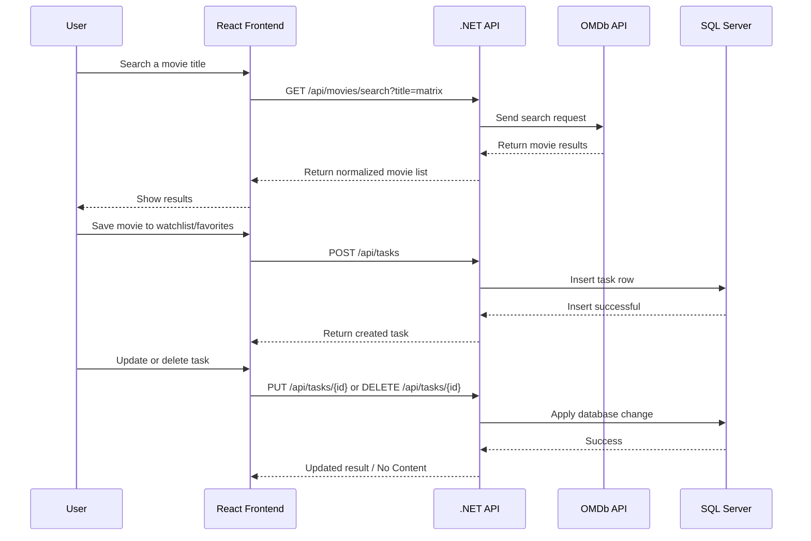

# MovieSearchAPI

MovieSearchAPI is a full-stack movie discovery and task tracking application built with **.NET 10**, **React**, **SQL Server**, and **Docker Compose**. Users can search movies through the **OMDb API**, save them as watchlist or favorite items, review saved entries, mark movies as watched, and delete items they no longer need.

The project is intentionally simple and practical:

- the **frontend** provides a single-page user experience,
- the **backend** protects the OMDb API key and exposes REST endpoints,
- the **database** stores saved movie tasks persistently,
- and **Docker Compose** runs the full stack together.

## Features

- Search movies by title using the OMDb API
- Save a movie as a **Watchlist** or **Favorite** item
- Add an optional note while saving a movie
- List saved tasks from SQL Server
- Filter tasks by status: **All**, **Pending**, **Watched**
- Update category and watched status
- Delete saved tasks
- Run everything locally with Docker Compose

## Tech Stack

### Backend
- .NET 10 Web API
- Entity Framework Core 10
- SQL Server provider for EF Core

### Frontend
- React 19
- Vite 8
- React Router
- Axios

### Infrastructure
- Microsoft SQL Server 2022
- Docker
- Docker Compose
- Nginx

### External Service
- OMDb API

## Architecture

The application follows a simple 3-layer structure:

1. **Frontend (React SPA)**  
   Handles the UI, search form, task list, filters, and user actions.

2. **Backend (.NET Web API)**  
   Exposes REST endpoints for movie search and task management. It also hides the OMDb API key from the frontend.

3. **Database (SQL Server)**  
   Stores saved movie tasks, including category, watched status, notes, year, and poster URL.

## Request Flow



## Project Structure

```text
MovieSearchAPI/
├── Backend/
│   ├── Controllers/
│   │   ├── MoviesController.cs
│   │   └── TasksController.cs
│   ├── Data/
│   │   └── ApplicationDbContext.cs
│   ├── DTOs/
│   │   ├── MovieSearchItemDto.cs
│   │   ├── MovieTaskDto.cs
│   │   └── UpsertMovieTaskDto.cs
│   ├── Migrations/
│   ├── Models/
│   │   └── MovieTask.cs
│   ├── Services/
│   │   └── OmdbService.cs
│   ├── appsettings.json
│   ├── Backend.csproj
│   ├── Backend.http
│   ├── Dockerfile
│   └── Program.cs
├── Frontend/
│   ├── public/
│   ├── src/
│   │   ├── api/
│   │   │   └── axiosClient.js
│   │   ├── components/
│   │   │   ├── MovieCard.jsx
│   │   │   ├── Navbar.jsx
│   │   │   └── TaskItem.jsx
│   │   ├── pages/
│   │   │   ├── SearchPage.jsx
│   │   │   └── TasksPage.jsx
│   │   ├── App.jsx
│   │   ├── index.css
│   │   └── main.jsx
│   ├── Dockerfile
│   ├── nginx.conf
│   ├── package.json
│   └── vite.config.js
├── docker-compose.yml
├── global.json
├── .gitignore
└── README.md
```

## Environment Variables

Create a local `.env` file in the project root. Do **not** commit it.

Example:

```env
OMDB_API_KEY=your_real_omdb_key
MSSQL_SA_PASSWORD=YourStrongPassword123!
```

### Variable Reference

| Variable | Required | Description |
|---|---:|---|
| `OMDB_API_KEY` | Yes | API key used by the backend for OMDb requests |
| `MSSQL_SA_PASSWORD` | Yes | SQL Server `sa` password used by Docker Compose |

### OMDb Activation Note

If the search endpoint returns an authorization error even though the key looks correct, make sure your OMDb key has been **activated from the confirmation email**.

## Secret Management

This project is prepared to be pushed to GitHub safely:

- `.env` files are ignored by Git
- `appsettings.Development.json` is ignored by Git
- the backend supports **user-secrets** through `UserSecretsId`
- the OMDb key is never exposed to the frontend

For local backend development without Docker, you can also use user-secrets:

```bash
dotnet user-secrets set "Omdb:ApiKey" "YOUR_KEY" --project Backend/Backend.csproj
```

## Prerequisites

Before running the project locally, make sure you have:

- .NET SDK 10
- Node.js 24+
- npm
- Docker Desktop

## Running with Docker Compose

This is the recommended way to run the full project.

### 1. Create a `.env` file

```env
OMDB_API_KEY=your_real_omdb_key
MSSQL_SA_PASSWORD=YourStrongPassword123!
```

### 2. Start the stack

```bash
docker compose up --build -d
```

### 3. Open the application

- Frontend: http://localhost:3000
- Backend: http://localhost:5202
- Health endpoint: http://localhost:5202/health

### 4. Stop the stack

```bash
docker compose down
```

To also remove the database volume:

```bash
docker compose down -v
```

## Running Without Docker

### Backend

```bash
dotnet restore Backend/Backend.csproj
dotnet ef database update --project Backend/Backend.csproj
dotnet run --project Backend/Backend.csproj
```

Backend runs on:

- http://localhost:5202

### Frontend

```bash
npm install --prefix Frontend
npm run dev --prefix Frontend
```

Frontend runs on:

- http://localhost:5173

During development, Vite proxies `/api` requests to `http://localhost:5202`.

## API Endpoints

### Health

| Method | Endpoint | Description |
|---|---|---|
| GET | `/health` | Returns API health status |

### Movies

| Method | Endpoint | Description |
|---|---|---|
| GET | `/api/movies/search?title=matrix` | Searches OMDb by movie title |

### Tasks

| Method | Endpoint | Description |
|---|---|---|
| GET | `/api/tasks` | Returns all saved tasks |
| GET | `/api/tasks?isWatched=true` | Filters tasks by watched status |
| GET | `/api/tasks/{id}` | Returns a single task |
| POST | `/api/tasks` | Creates a new task |
| PUT | `/api/tasks/{id}` | Updates a task |
| DELETE | `/api/tasks/{id}` | Deletes a task |

### Example Task Payload

```json
{
  "title": "The Matrix",
  "description": "Sci-fi classic",
  "category": "Watchlist",
  "isWatched": false,
  "year": "1999",
  "posterUrl": null
}
```

## Database Model

The main entity is `MovieTask`.

| Field | Type | Description |
|---|---|---|
| `Id` | int | Primary key |
| `Title` | string | Movie title |
| `Description` | string? | Optional note |
| `Category` | string | Example: `Watchlist`, `Favorite` |
| `IsWatched` | bool | Watched status |
| `Year` | string? | Release year |
| `PosterUrl` | string? | Poster image URL |

## Useful Commands

```bash
dotnet build Backend/Backend.csproj
npm run build --prefix Frontend
npm run lint --prefix Frontend
docker compose ps
```

## Push-Ready Checklist

- [x] Secrets are excluded from version control
- [x] Root README is written in English
- [x] Docker-based setup is documented
- [x] Environment variables are documented
- [x] API endpoints are documented
- [x] Build and lint commands are documented

## Notes Before Pushing

Before pushing to GitHub:

1. keep your `.env` file local,
2. keep your OMDb key active,
3. commit from the correct repository root.